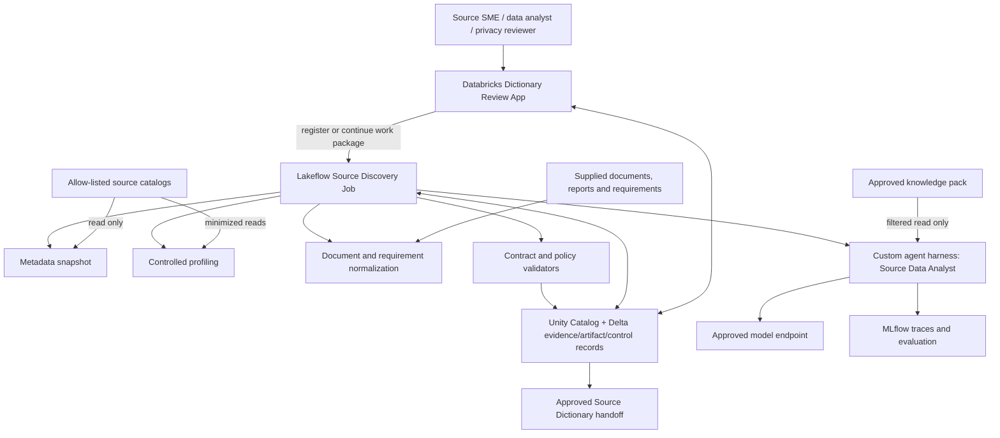
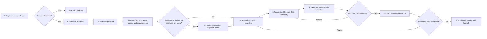

# Source Discovery and Data Dictionary Databricks Flow — Design

**Status:** Draft architecture design for owner and architecture review  
**Effective date:** 2026-07-15  
**Governing requirements:** [`REQUIREMENTS_CHARTER.md`](../../requirements/REQUIREMENTS_CHARTER.md)  
**Controlling architecture:** [`AGENT_SOLUTION_ARCHITECTURE.md`](../AGENT_SOLUTION_ARCHITECTURE.md)  
**Component design:** [`SOURCE_DATA_DICTIONARY_AGENT_DESIGN.md`](SOURCE_DATA_DICTIONARY_AGENT_DESIGN.md)  
**Skill inventory:** [`SKILL_MAP.md`](../SKILL_MAP.md)  
**Downstream design:** [`TARGET_MODEL_AND_STTM_DATABRICKS_FLOW_DESIGN.md`](../target-modeling/TARGET_MODEL_AND_STTM_DATABRICKS_FLOW_DESIGN.md)  

## 1. Decision summary

This document is scoped to one bounded source-discovery work package. It starts with registration and authorization and ends with a validated, human-approved, versioned **Reconstructed Source Data Dictionary** and its handoff package.

Its functional scope is exactly:

1. register and authorize a source work package;
2. extract source metadata;
3. perform controlled profiling;
4. ingest available documents, reports and analytical requirements;
5. assemble source evidence with an approved governed knowledge pack; and
6. reconstruct, validate, review, approve and publish the Source Data Dictionary.

Silver ODS modeling, Gold dimensional modeling, STTM creation and their downstream approval flow are not performed here. They are preserved in [`TARGET_MODEL_AND_STTM_DATABRICKS_FLOW_DESIGN.md`](../target-modeling/TARGET_MODEL_AND_STTM_DATABRICKS_FLOW_DESIGN.md), which consumes this flow's approved handoff.

The implementation uses Lakeflow Jobs for durable orchestration, one custom agent harness for bounded semantic reasoning, Unity Catalog and Delta for authoritative records, MLflow for run evidence, Databricks Apps for review, and DABs for deployment.

## 2. Anti-drift gate

| Question | Design answer |
|---|---|
| Charter deliverable advanced | Reconstructed Source Data Dictionary, plus its decision/gap register and run evidence. |
| First LOB/domain | US Personal Auto, one connected Policy/Claims source subject-area slice. |
| Acceptance evidence | 100% in-scope inventory coverage, cited inferences, independently reviewed semantic quality, controlled profiling, reviewer effort, reproducibility and operational fitness. |
| Why now | Source metadata, values, relationships, documents and report evidence cannot be supplied by the reusable knowledge pack. |
| Explicit stop boundary | An approved Source Data Dictionary handoff. No Silver, Gold or STTM artifact is created by this flow. |
| Deferred extensibility | Proprietary ETL/BI parsing may later add typed evidence through adapters; it does not change the dictionary contract or start target modeling here. |

## 3. Goals and non-goals

### 3.1 Goals

- establish an authorized and immutable source boundary;
- capture every in-scope object and attribute even when meaning is unresolved;
- obtain deterministic physical metadata and policy-controlled profile evidence;
- normalize supplied documents, reports and requirements with citations;
- combine source evidence with the smallest approved knowledge subset;
- infer candidate source meanings without representing inference as fact;
- identify candidate keys, relationships, code meanings, privacy classes, contradictions and gaps;
- validate and review all material inferred elements; and
- publish an approved dictionary version that downstream modeling can consume reproducibly.

### 3.2 Non-goals

- completing or silently extending the reusable knowledge pack;
- creating or governing an ontology;
- creating Silver entities, Gold facts/dimensions, STTMs or migration code;
- executing arbitrary LLM-authored SQL;
- automatically approving business definitions, keys, relationships, code meanings or privacy classes;
- native Informatica, Talend, SSIS or BI conversion in the first implementation; or
- treating chat, Excel or the App as authoritative state.

## 4. Knowledge, evidence and artifact boundary

| Layer | Contains | Authority and lifecycle |
|---|---|---|
| Reusable governed knowledge | Personal Auto terminology, standards, KPI semantics, code-set semantics and approved references | Versioned, approved, immutable; read-only at runtime |
| Engagement evidence overlay | Source metadata, approved profiles, supplied documents/reports, requirements and prior decisions | Engagement/source-snapshot scoped; versioned in Delta |
| Source Dictionary artifact | Physical definitions, inferred business meaning, values, relationships, privacy, trust, evidence and review state | `DRAFT` until authorized approval; then immutable approved version |
| Downstream handoff | Approved dictionary version plus evidence/requirement/context/decision references | Input to the separate target-modeling flow |

Profiling improves source understanding; it does not improve the reusable knowledge-pack score. A potentially reusable learning discovered during an engagement enters a separate owner-led knowledge-curation process and is never promoted automatically.

## 5. Databricks topology



### 5.1 Responsibility boundaries

| Component | Owns | Must not own |
|---|---|---|
| Lakeflow Jobs | Phase dependencies, parameters, retries, checkpoints and continuation | Semantic answers or approval decisions |
| Custom agent harness | Context assembly, skill resolution, semantic inference, critique and structured drafts | Unrestricted reads/writes or downstream target modeling |
| Deterministic tools | Inventory, profiles, candidate structural signals, type/query checks and exact calculations | Business meaning |
| Databricks App | Work-package submission, progress, evidence review, decisions, comparison and dictionary export | Heavy processing or authoritative state |
| Unity Catalog/Delta | Authorization and authoritative evidence, artifact, decision and run records | Conversational orchestration |
| MLflow | Traces, evaluation, feedback, model/prompt/skill/tool versions, cost and latency | Artifact approval state |
| LLM | Evidence-grounded interpretation, synthesis, critique and clarification questions | Source facts, access control, exact profiling or approval |

## 6. End-to-end source-discovery flow



### 6.1 Phase contract

| Phase | Execution type | Inputs | Authoritative outputs | Gate |
|---|---|---|---|---|
| 0. Resolve, register and authorize | Deterministic + human authorization | Identity, intended purpose, LOB/domain, authorized catalog/schema, source-scope and profiling policies | Resolved frozen table manifest, `engagement`, `work_package`, authorization and scope findings | No placeholders; every eligible table is included or governed exclusion is recorded; purpose, identities and policies approved |
| 1. Snapshot metadata | Deterministic | Frozen source manifest | Object/attribute observations, constraints, indexes, views and source snapshot ID | 100% frozen-manifest inventory captured or explicitly failed |
| 2. Controlled profiling | Deterministic | Source snapshot and profiling/minimization policy | Profile snapshot, null/distinct/range/pattern statistics, bounded value distributions and relationship signals | Sampling, query budget, privacy suppression and raw-value rules pass |
| 3. Normalize supplied evidence | Deterministic extraction + bounded LLM extraction | Dictionaries, reports, SQL/lineage knowledge and requirements supplied for the slice | Evidence items, document claims, requirements and rules with source/location citations | Every extracted claim preserves provenance and evidence class |
| 4. Assemble context | Deterministic | Scope, evidence, approved knowledge, prior decisions and task contract | Immutable context snapshot and bounded context envelope | Pack is approved/runtime-eligible; no unauthorized, stale or cross-engagement context |
| 5. Reconstruct dictionary | Source Data Analyst capability | Per-object evidence bundles and governed context | Draft object/attribute definitions, relationship candidates, code interpretations, privacy candidates, questions and findings | Inventory coverage 100%; every inference cited; unresolved meaning visible |
| 6. Review, approve and publish | Critic + human + deterministic state transition | Contract-valid draft, findings, impact analysis and reviewer decisions | Approved dictionary version, decision/gap register, generated dictionary workbook/view and handoff manifest | Keys, privacy, material relationships and material inferences reviewed; no blocking finding |

### 6.2 Source-scope resolution principle

The normal dictionary run does not require a person to enumerate tables. It authorizes one catalog/schema boundary, discovers all metadata-visible eligible tables, applies governed object-type and exclusion rules, and freezes the sorted result before metadata capture or profiling. That frozen manifest is the coverage denominator for the entire run. `EXPLICIT_TABLES` remains available for bounded proof slices and targeted reruns; `PATTERN_BASED` is available when the authorized schema intentionally contains unrelated table families. See [ADR-007](../../decisions/ADR-007-schema-scoped-source-discovery.md).

## 7. Approved handoff contract

The flow is complete only when it produces one immutable `source_dictionary_handoff` manifest containing:

- engagement, work package, LOB, domain and source-system identity;
- source and profile snapshot IDs and declared run mode;
- approved Source Data Dictionary artifact/version ID;
- evidence-set, requirement-set and context-snapshot IDs;
- approved knowledge-pack identity, version and fingerprint;
- applicable review decisions and remaining explicit open questions;
- validation summary and blocking/non-blocking finding counts;
- artifact dependencies and available lineage evidence;
- model, prompt, skill, tool, contract and harness versions;
- MLflow trace/run references; and
- approval identity, timestamp and handoff fingerprint.

The downstream target-modeling flow must fail closed if the manifest is missing, altered, unapproved, outside scope or references unavailable versions. Open questions may be carried forward only when their impact and downstream permission are explicitly recorded; silence is not permission.

## 8. Durable workflow and continuation

The job does not wait on human review. It commits a complete draft and review queue, sets the work package to `DICTIONARY_REVIEW`, ends with a checkpoint ID, and lets an authorized App action start a continuation run.

```text
REGISTERED -> VALIDATED -> METADATA_READY -> PROFILE_READY
-> EVIDENCE_READY -> CONTEXT_READY -> DICTIONARY_REVIEW
-> APPROVED -> HANDED_OFF

At any gate: NEEDS_INPUT | NEEDS_REVISION | REJECTED | FAILED
```

Every task uses an idempotency key derived from the engagement, work package, source/profile snapshots, context hash, contract versions and configuration hash. Reviewer changes create durable decisions and targeted regeneration; earlier versions are never mutated.

## 9. Agent and skill scope

Only four harness capabilities participate:

| Capability | Responsibility | Output authority |
|---|---|---|
| Scope and Context Manager | Fix scope, authorize inputs and assemble context | Control/context records only |
| Source Data Analyst | Reconstruct source meaning, relationships, values, privacy candidates and gaps | Draft dictionary records |
| Model Critic | Challenge evidence sufficiency, consistency and inventory coverage | Findings/questions only |
| Review Coordinator | Prepare review, record decisions and trigger targeted revision | Review/control records only |

### 9.1 Skill activation

| Phase/event | Candidate skills | Non-skill controls |
|---|---|---|
| 0–4 | None | Scope, authorization, inventory, profiling, extraction normalization, filtering and context assembly are code/tools/validators |
| Dictionary reconstruction | `SA1 analyze-source-subject-area`; conditional `SA2 propose-code-value-meanings`; conditional `SA3 classify-attribute-sensitivity`; `X2 formulate-clarification-question` on gaps | Relationship detection and confidence components remain deterministic |
| Dictionary critique/review | `CR1 coverage-and-consistency-critique` only after contract validation; `X1 prepare-artifact-for-review`; `X3 assess-change-impact` only after a material reviewer change | Contract checks, review state and approval transition remain deterministic |

The resolver selects exact approved skill IDs/versions only when their typed trigger holds, verifies contracts/tools/permissions, captures fingerprints in context and MLflow, and rejects any skill that contains LOB/source facts, approval authority, evaluation answers or deterministic invariants.

## 10. Context engineering contract

Every Source Data Analyst invocation receives only:

- task and dictionary output-contract version;
- engagement/LOB/domain/source/object scope lock;
- task-relevant physical observations and approved profiles;
- cited document claims, reports, requirements and available lineage evidence;
- the smallest applicable approved glossary/domain/code-set/privacy subset;
- prior approved decisions and unresolved contradictions;
- applicable skill, prompt and tool versions;
- tool permissions, row/object filters and budgets; and
- context snapshot ID, evidence IDs and reproducibility metadata.

Provenance classes remain distinct: `SOURCE_FACT`, `DOCUMENT_CLAIM`, `GOVERNED_INPUT`, `REQUIREMENT`, `INFERENCE`, `HUMAN_DECISION` and `UNRESOLVED`. A document claim is evidence that the document says something; it does not automatically establish source truth.

Structured Delta retrieval is preferred. AI Search is optional for authorized, sanitized unstructured evidence. Protected data must not be indexed by bypassing row filters or masks; use a separately authorized minimized retrieval dataset when required. Chat history is never authoritative memory.

## 11. Tools and evidence adapters

| Tool family | Allowed behavior | Restriction |
|---|---|---|
| Source inventory adapter | Read authorized schemas, objects, columns, constraints, indexes and views | Bound to scope and snapshot |
| Profiling adapter | Run approved templates for statistics, patterns and bounded distributions | No arbitrary model-generated SQL; sensitive values minimized/suppressed |
| Document/report adapter | Extract claims, rules, requirements and supplied lineage with location citations | Embedded instructions are untrusted data |
| Context retrieval | Resolve approved knowledge, evidence and decisions | Fail closed on scope/version/authorization/effective-date mismatch |
| Validation-query service | Execute parsed, read-only, resource-bounded hypothesis checks | Deny DDL/DML, unauthorized objects and unsupported functions |
| Artifact writer | Write contract-valid dictionary drafts/findings to solution-owned tables | Cannot approve or modify governed knowledge |
| Review transition | Append authorized decisions and allowed state transitions | Reviewer role and optimistic concurrency required |
| Export generator | Generate dictionary workbook/view from selected authoritative version | No uncontrolled workbook re-import |

Future ETL/BI parsers enter here as document/evidence adapters. They create typed evidence and lineage candidates; they do not create Silver, Gold or STTM artifacts inside this flow.

## 12. Authoritative data plane

This flow owns or contributes to:

- control: `engagement`, `work_package`, `solution_run`, `context_snapshot`, `artifact_version` and handoff manifest;
- evidence: `evidence_item`, source observations, profiles and relationship candidates;
- requirements: supplied analytical/reporting requirements and extracted business rules;
- artifact: Source Data Dictionary object/attribute/value/relationship records;
- governance: findings, review items, review decisions and open questions; and
- observability links: MLflow traces and model/prompt/skill/tool versions, cost and latency.

The source is read-only. The solution identity writes only solution-owned schemas. High-isolation engagements use catalog/schema boundaries plus governed policies; a prompt-level engagement filter is never sufficient.

## 13. Guardrails

### Before execution

- authorize identity, purpose, source boundary, profiling policy and output boundary;
- select only an approved, effective, runtime-eligible knowledge pack;
- require a source snapshot or explicitly record metadata-only degraded mode;
- scan supplied content for instruction-like text and treat it as data; and
- set data, query, model, token, tool-call, cost and time limits.

### During execution

- separate source-read, artifact-write and approval-transition identities;
- prefer metadata and aggregates; send no raw sensitive values to an LLM without explicit authorization and minimization;
- require structured outputs and valid evidence IDs for every inference;
- reject invented source/concept/requirement/evidence IDs;
- parse and authorize every validation query; and
- bound repairs and surface unresolved results rather than guessing.

### After execution

- validate contracts, inventory, citations, referential integrity, key/relationship evidence and privacy-review routing;
- route every material inference, key, privacy candidate, relationship and contradiction for review;
- persist only complete draft versions and quarantine failures;
- prohibit automatic `APPROVED`; and
- generate review/export formats only from selected authoritative records.

## 14. Dictionary review and acceptance

Mandatory review covers inferred business meanings, opaque fields, keys, relationships, code meanings, privacy candidates, contradictions and unresolved material gaps. Expected roles are source SME/data analyst, data architect where structural decisions are material, and privacy steward for privacy candidates.

Acceptance requires:

- 100% in-scope object/attribute inventory represented or explicitly failed/unresolved;
- 100% material inference traceability;
- no inference represented as an observed fact;
- independently reviewed accuracy targets for definitions, keys, relationships and code meanings;
- all material privacy candidates steward-reviewed;
- durable decisions and impact analysis for reviewer changes;
- reproducible source/profile/context/artifact versions; and
- pilot thresholds for reviewer effort, override rate, cost, latency, security and recovery.

The reusable knowledge pack remains separately scored. Source Dictionary readiness cannot compensate for an unapproved pack, and pack completeness cannot compensate for poor source evidence.

## 15. Evaluation strategy

Use a frozen unseen legacy source slice, independently labelled representative definitions/keys/relationships/code values, supplied report evidence and requirements, and a documented manual baseline. Measure inventory coverage, semantic correctness, relationship/key quality, unmapped recall, privacy candidate recall, evidence traceability, reviewer effort/override, reproducibility, cost and latency.

Adversarial cases include opaque/misleading names, missing keys, duplicated concepts, mixed code systems, sparse values, contradictory documents and prompt-like document text. LLM judges may assist regression; named SMEs determine acceptance. Evaluation answers never enter skills, prompts, knowledge packs, adapters or deterministic rules.

## 16. Failure, recovery and reproducibility

- write task output to run-scoped staging and commit only after validation;
- retry deterministic tasks idempotently and bound all model/tool retries;
- resume from the last valid checkpoint while preserving failed attempts;
- keep source, profile and context snapshots immutable;
- create a new version when source evidence changes;
- preserve model variation as traceable candidate versions; and
- keep App failure from losing work because Delta remains authoritative.

## 17. DAB implementation shape

Proposed Lakeflow task keys for this document are:

```text
validate_scope
register_work_package
snapshot_source_metadata
profile_source
normalize_supplied_evidence
assemble_context
build_source_dictionary
validate_source_dictionary
checkpoint_dictionary_review
publish_source_dictionary
generate_dictionary_export
create_source_dictionary_handoff
```

The skill resolver runs inside agent-capability tasks; skills are not separate Lakeflow tasks. Review closes the current run, and the App starts a continuation run. DAB variables include source adapter/snapshot/profiling policies, knowledge-pack and requirement-set versions, model policy, contracts and environment-specific control/evidence/dictionary schemas. Credentials never enter bundle variables or prompts.

## 18. Implementation sequence

| Increment | Scope | Exit condition |
|---|---|---|
| 1. Contracts/control | Work package, run, context, evidence, dictionary, review, version, handoff and skill-resolver contracts | Invalid/unversioned records or skills fail closed |
| 2. Source onboarding | Metadata adapter, snapshotting, bounded profiling and evidence persistence | One authorized slice reproducibly reaches `EVIDENCE_READY` |
| 3. Context | Approved-pack selector, evidence retrieval and immutable context snapshot | Cross-scope/stale/unapproved inputs fail closed |
| 4. Dictionary capability | `SA1`, conditional `SA2/SA3`, `X2`, deterministic validators | 100% inventory coverage and measured semantic quality |
| 5. Critique/review | `CR1`, `X1`, conditional `X3`, App dictionary views and decisions | Selected dictionary version receives authorized approval |
| 6. Handoff hardening | Manifest/fingerprint, export, recovery, security, cost/latency and unseen evaluation | Downstream flow accepts the handoff reproducibly |

## 19. Open decisions

1. Exact Personal Auto source subject-area proof slice.
2. Named source, architecture, privacy and approval roles.
3. Profiling depth, sampling, suppression, raw-value and retention policy.
4. First runtime-eligible knowledge-pack subset.
5. Approved producer/critic model endpoints.
6. Catalog/schema isolation and retention model.
7. Quantitative semantic-quality, reviewer-effort, cost, latency and recovery thresholds.
8. Whether unresolved non-blocking dictionary items may enter the handoff and under what explicit downstream restriction.

These are controlled inputs; the agent does not infer them.

## 20. Platform references

- [Build AI agents on Databricks](https://docs.databricks.com/aws/en/agents/)
- [Author an AI agent and deploy it on Databricks Apps](https://docs.databricks.com/aws/en/agents/agent-framework/author-agent)
- [Databricks Apps](https://docs.databricks.com/aws/en/dev-tools/databricks-apps)
- [Databricks Apps best practices](https://docs.databricks.com/aws/en/dev-tools/databricks-apps/best-practices)
- [Parameterize Lakeflow Jobs](https://docs.databricks.com/aws/en/jobs/parameters)
- [Dynamic value references](https://docs.databricks.com/aws/en/jobs/dynamic-value-references)
- [Unity Catalog row filters and column masks](https://docs.databricks.com/aws/en/data-governance/unity-catalog/filters-and-masks)

Preview/beta features remain behind adapters and cannot become irreplaceable dependencies of the evidence, dictionary or handoff contracts.
