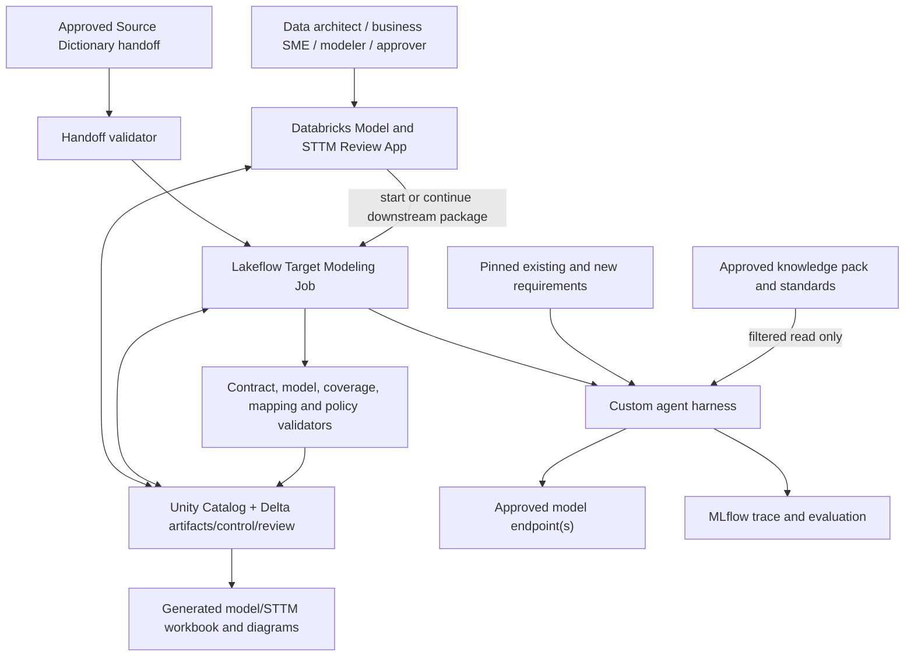

# Target Model and STTM Databricks Flow — Design

**Status:** Draft downstream architecture design for owner and architecture review  
**Effective date:** 2026-07-15  
**Governing requirements:** [`REQUIREMENTS_CHARTER.md`](../../requirements/REQUIREMENTS_CHARTER.md)  
**Controlling architecture:** [`AGENT_SOLUTION_ARCHITECTURE.md`](../AGENT_SOLUTION_ARCHITECTURE.md)  
**Required upstream flow:** [`SOURCE_DEPENDENT_DATABRICKS_FLOW_DESIGN.md`](../source-data-dictionary/SOURCE_DEPENDENT_DATABRICKS_FLOW_DESIGN.md)  
**Skill inventory:** [`SKILL_MAP.md`](../SKILL_MAP.md)  

## 1. Decision summary

This document preserves the downstream content removed from the source-discovery flow. It starts from an approved, fingerprint-valid `source_dictionary_handoff` and creates the remaining charter deliverables:

1. Silver ODS model;
2. Gold dimensional model;
3. source-to-Silver and Silver-to-Gold STTMs;
4. requirement coverage and lineage;
5. decision/gap records; and
6. downstream run evidence and review exports.

It does not profile sources, reconstruct source meaning or modify the approved Source Data Dictionary. If downstream reasoning exposes a source-dictionary defect, it raises a versioned change request and returns control to the upstream flow rather than silently editing the dictionary.

Lakeflow Jobs provide durable phase orchestration; one custom agent harness supplies contract-bound Silver, Gold, STTM and critic capabilities; Unity Catalog/Delta remain authoritative; MLflow captures run evidence; Databricks Apps provide review; DABs deploy resources.

## 2. Anti-drift gate

| Question | Design answer |
|---|---|
| Charter deliverables advanced | Silver ODS, Gold dimensional model, STTM, requirement coverage, downstream decisions/gaps and run evidence. |
| LOB/domain | Same engagement, US Personal Auto LOB/domain and bounded subject slice declared in the approved dictionary handoff. |
| Acceptance evidence | Evidence traceability, grain/key/history/conformance quality, mapping completeness, requirement coverage, independent review, reviewer effort, reproducibility and operational fitness. |
| Why separate | Target-model design is a distinct lifecycle that requires an approved source-understanding baseline and different skills/review roles. |
| Explicit upstream boundary | No source profiling or dictionary reconstruction. Source issues are returned as change requests. |
| Deferred scope | ETL/BI conversion, migration-pipeline generation/execution, physical schema deployment and production cutover. |

## 3. Entry and handoff validation

The flow fails closed unless the upstream manifest provides:

- matching engagement, work package, LOB, domain and source identity;
- approved Source Data Dictionary artifact/version;
- immutable source/profile/evidence/context/requirement snapshots;
- approved knowledge-pack version and fingerprint;
- decisions, open questions and their downstream permissions;
- validation summary with no unresolved blocking finding;
- artifact dependency and available lineage references;
- model/prompt/skill/tool/contract/harness versions and MLflow references; and
- authorized approval and handoff fingerprint.

The flow creates a new target-modeling work package that pins this manifest. It never references “latest” dictionary or knowledge state implicitly. A changed upstream version invalidates affected downstream artifacts through dependency records and requires an explicit continuation or restart decision.

## 4. Goals and non-goals

### 4.1 Goals

- create scalable Silver entity, attribute, relationship, history, privacy and DQ designs;
- create requirement-driven Gold facts, dimensions, grains, measures, SCD behavior and conformance;
- map source-to-Silver and Silver-to-Gold at attribute level;
- record transformations, joins, lookups, defaults, exceptions, DQ, lineage and reconciliation criteria;
- trace every material element to the approved dictionary, a requirement, governed input or human decision;
- preserve existing-report intent and cover explicitly supplied new analytical requirements;
- use staged human approval before admitting downstream skills; and
- publish authoritative Delta versions and generated review/export formats.

### 4.2 Non-goals

- changing source facts or source-dictionary definitions inside this flow;
- ontology creation/governance or automatic knowledge-pack extension;
- source metadata extraction or profiling;
- native ETL/BI project conversion;
- migration pipeline generation/execution or physical deployment; and
- automatic approval of model grain, financial/KPI logic, mappings or exceptions.

## 5. Databricks topology



Heavy processing and validation run in Lakeflow/SQL, not in App compute. The App initiates work, presents evidence and versions, records decisions, and requests exports.

## 6. End-to-end downstream flow

```mermaid
flowchart LR
    P0["0 Validate dictionary handoff"] --> G0{"Handoff accepted?"}
    G0 -->|"No"| STOP["Stop or return source change request"]
    G0 -->|"Yes"| P1["1 Assemble Silver context"]
    P1 --> P2["2 Create Silver ODS model"]
    P2 --> V2["Critique and validate Silver"]
    V2 --> H2["Human Silver decisions"]
    H2 --> A2{"Silver approved?"}
    A2 -->|"Revise"| P1
    A2 -->|"Yes"| P3["3 Assemble Gold context"]
    P3 --> P4["4 Create Gold model and coverage"]
    P4 --> V4["Critique and validate Gold"]
    V4 --> H4["Human Gold decisions"]
    H4 --> A4{"Gold approved?"}
    A4 -->|"Revise"| P3
    A4 -->|"Yes"| P5["5 Assemble STTM context"]
    P5 --> P6["6 Create STTM and lineage"]
    P6 --> V6["Critique, validate and reconcile"]
    V6 --> H6["Human STTM/package decisions"]
    H6 --> A6{"Package approved?"}
    A6 -->|"Revise"| P5
    A6 -->|"Source defect"| STOP
    A6 -->|"Yes"| P7["7 Publish artifacts and exports"]
```



### 6.1 Phase contract

| Phase | Execution type | Inputs | Authoritative outputs | Gate |
|---|---|---|---|---|
| 0. Validate handoff/register package | Deterministic + authorization | Approved handoff, identity, target scope and policies | Target work package, pinned dependencies and findings | Scope/fingerprint/version/approval all valid |
| 1–2. Create Silver | Context assembler + Silver Modeler | Approved dictionary slice, requirements, decisions and governed standards | Silver entities, attributes, relationships, grain, keys, types, history, privacy, DQ and source coverage | Contract/grain/key/history/type/coverage validations pass; selected Silver version human-approved |
| 3–4. Create Gold/coverage | Context assembler + Gold Modeler | Approved Silver version, reporting/new requirements, KPI/standards inputs | Facts, dimensions, grains, measures, conformance, SCD rules and requirement coverage | Every fact has explicit grain; measures/dimensions trace to requirements and Silver; selected Gold version human-approved |
| 5–6. Create STTM/lineage | Context assembler + STTM Modeler | Approved dictionary/Silver/Gold versions, transformations, rules and requirements | Source-to-Silver and Silver-to-Gold mappings, joins, lookups, defaults, exceptions, DQ, lineage and reconciliation | Every required target attribute has a source, derivation, approved default or explicit gap; package human-approved |
| 7. Publish | Deterministic state transition/export | Approved versions, decisions and run evidence | Immutable artifact versions, coverage, lineage, decision history, Excel/diagrams and publication manifest | No blocking finding; exports derive from selected Delta versions |

## 7. Durable approval continuation

Each producer ends at a review checkpoint; jobs do not wait for human action.

```text
REGISTERED -> HANDOFF_VALIDATED -> SILVER_REVIEW -> SILVER_APPROVED
-> GOLD_REVIEW -> GOLD_APPROVED -> STTM_REVIEW -> PACKAGE_APPROVED
-> PUBLISHED

At any gate: NEEDS_SOURCE_CHANGE | NEEDS_INPUT | NEEDS_REVISION | REJECTED | FAILED
```

The App writes append-only decisions and starts a continuation run. Artifact states remain `DRAFT` until authorized approval. A future owner-approved `BASELINED` state may support more iterative co-design, but no resolver may treat `DRAFT` as `APPROVED` implicitly.

Every phase uses idempotency keys derived from the target work package, upstream handoff, context hash, upstream artifact versions, contracts and configuration. A reviewer change invokes impact analysis and invalidates only affected downstream elements.

## 8. Agent and skill scope

| Capability | Responsibility | Output authority |
|---|---|---|
| Scope and Context Manager | Validate handoff, lock target scope and assemble task context | Control/context records only |
| Silver ODS Modeler | Design source-aligned/canonical ODS structures | Draft Silver records |
| Gold Dimensional Modeler | Design facts, dimensions, measures, grains and conformance | Draft Gold/coverage records |
| STTM and Lineage Modeler | Create source-to-Silver and Silver-to-Gold mappings/lineage | Draft mapping/lineage records |
| Model Critic | Challenge evidence, grain, history, coverage, conformance and mappings | Findings/questions only |
| Review Coordinator | Prepare reviews, record decisions, assess impacts and target regeneration | Review/control records only |

### 8.1 Skill activation

| Phase/event | Candidate skills | Non-skill controls |
|---|---|---|
| Handoff validation/context assembly | None | Scope, fingerprints, approvals, retrieval/filtering and dependency checks are deterministic |
| Silver creation | `SL1 design-silver-entity-and-history`; `X2 formulate-clarification-question` on underdetermined choices | Type, grain, key, history and coverage checks are validators |
| Silver review | `CR1 coverage-and-consistency-critique`; `X1 prepare-artifact-for-review`; conditional `X3 assess-change-impact` | State/approval transition remains deterministic; Gold skill blocked until approved Silver exists |
| Gold creation | `GD1 determine-fact-grain`; conditional `GD2 design-conformed-dimension`; `X2` on conflicting requirements | Requirement inventory and exact coverage/grain checks remain code/validators |
| Gold review | `CR1`, `X1`, conditional `X3` | STTM skill blocked until approved Gold exists |
| STTM creation | `ST1 create-and-validate-sttm-slice`; `X2` on unsupported mappings | Mapping completeness, lineage integrity and reconciliation arithmetic remain validators/code |
| Package review/change | `CR1`, `X1`, conditional `X3`; rerun only invalidated producer skills | Approval, dependency invalidation and publication remain deterministic |

The applicable-skill resolver uses exact approved IDs, versions and fingerprints; enforces typed triggers/non-triggers and approved upstream dependencies; admits only authorized tools/evidence; captures selections in context and MLflow; and rejects facts, approval authority, answer keys or invariants embedded in a skill.

## 9. Context engineering

Each producer receives a new immutable context snapshot containing:

- target work package and exact task/output contract;
- pinned approved dictionary handoff and relevant evidence/decision/open-question subset;
- approved upstream Silver/Gold versions as applicable;
- existing and new requirements relevant to the model slice;
- smallest applicable approved standards, glossary, KPI, code-set and reference subset;
- prior target-modeling decisions and contradictions;
- applicable skill/prompt/model/tool versions;
- tool permissions, budgets and stop conditions; and
- context, evidence, requirement and upstream artifact IDs.

The context assembler retrieves per connected model/requirement slice rather than dumping the engagement. Source facts, governed inputs, requirements, inferences and human decisions remain distinct. A summary retains provenance and omitted scope. Chat history is not memory.

## 10. Tools and adapter boundaries

| Tool family | Allowed behavior | Restriction |
|---|---|---|
| Handoff/artifact retrieval | Resolve pinned approved dictionary/Silver/Gold versions | Fail closed on scope, status, version, fingerprint or authorization mismatch |
| Requirement/KPI retrieval | Retrieve relevant existing/new requirements and approved semantic inputs | Cannot invent or silently broaden requirements |
| Read-only validation query | Validate mapping/join/measure hypotheses against authorized source/profile views | Parsed and resource-bounded; no DDL/DML or unrestricted source access |
| Model validators | Check grain, keys, types, history, conformance, coverage and naming | Deterministic pass/fail; no encoded semantic answer keys |
| Mapping/lineage validators | Check target coverage, references, lineage and reconciliation contracts | Cannot approve an exception |
| Artifact writer | Persist contract-valid draft model/mapping/finding records | Cannot change approved upstream records or assign approval |
| Review/impact tool | Append decisions, traverse dependencies and trigger allowed continuation | Requires role and concurrency/version checks |
| Export generator | Generate Excel and diagrams from selected versions | No uncontrolled re-import |

Future ETL/BI adapters may supply additional evidence to the upstream flow or transformation claims to a versioned evidence boundary. They never bypass approved dictionary/model inputs or directly publish STTM records.

## 11. Authoritative data plane

This flow owns or contributes to:

- control: target work package, solution runs, contexts, artifact versions and publication manifest;
- requirements: analytical/reporting requirements and business/transformation rules;
- Silver: entities, attributes, relationships, history and DQ rules;
- Gold: facts, dimensions, measures, relationships and conformance rules;
- mappings: mapping packages, attribute mappings, transformations, lookups and reconciliation rules;
- coverage/lineage: requirement coverage, artifact dependencies and lineage edges;
- governance: findings, review items, decisions, open questions and source-change requests; and
- observability links: MLflow traces and model/prompt/skill/tool versions, cost and latency.

The approved Source Dictionary and knowledge pack are read-only. The solution identity writes only solution-owned target artifact/review schemas. Apps expose governed views and role-bound decisions rather than broad table-write access.

## 12. Guardrails

### Before execution

- validate user/app identity, downstream authorization, handoff fingerprint and scope;
- select only approved/effective/runtime-eligible governed inputs and approved upstream artifacts;
- exclude cross-engagement/stale/unavailable content;
- require task-specific output contracts and applicable skills/tools; and
- enforce context, model, token, cost, tool-call, query and time budgets.

### During execution

- separate upstream reads, artifact writes and approval transitions;
- constrain every tool argument to the work package and artifact slice;
- require structured outputs and citations for every material element;
- prohibit invented source fields, concepts, requirements or evidence IDs;
- prohibit direct mutation of approved dictionary/Silver/Gold versions;
- bound repair loops and raise source-change requests when upstream evidence is wrong/insufficient; and
- trace retrieval, model, tool, skill and state activity.

### After execution

- validate contracts, referential integrity, grain, keys, history, source coverage, conformance, requirement coverage, mapping completeness, lineage and reconciliation specifications;
- run a critic after deterministic validation, preferably with a different approved model/reduced context;
- route material grain, history, KPI/financial logic, conformance, mappings, defaults and exceptions for human review;
- persist only complete draft versions and prohibit automatic approval; and
- generate App/Excel/diagram views only from selected authoritative versions.

## 13. Review gates and roles

| Gate | Mandatory focus | Expected roles |
|---|---|---|
| Silver | Entity boundaries, grain, identifiers, temporal/history strategy, privacy, DQ and source coverage | Data architect, source SME, privacy steward where applicable |
| Gold | Fact grain, measures, dimensions, SCD behavior, conformance and requirement coverage | Dimensional architect/modeler, business/reporting SME, finance/KPI owner where applicable |
| STTM/package | Transformations, joins, lookups, defaults, exceptions, DQ, lineage and reconciliation | Data architect, source/target SME and DQ owner |
| Publication | Blocking findings closed, decisions complete, versions/impacts understood | Authorized artifact owner/approver |

Reviewer modifications become durable decisions followed by impact analysis and targeted regeneration. Direct editing of authoritative model rows is not an acceptable review mechanism.

## 14. Downstream completeness and production readiness

Reusable knowledge completeness, Source Dictionary readiness and downstream artifact readiness remain separate.

| Measure | Acceptance direction |
|---|---|
| Evidence traceability | 100% of material model/mapping elements cite approved dictionary evidence, requirement, governed input or decision |
| Silver quality | Grain, keys, history, relationships, naming, privacy, DQ and source coverage independently approved |
| Gold quality | Fact grain, measures, dimensions, additivity, SCD and conformance independently approved |
| Mapping completeness | Every required target attribute has source, derivation, approved default or explicit gap |
| Requirement coverage | Every in-scope existing/new requirement is covered, retired by decision or unresolved |
| Human governance | No material inference or exception published without accountable approval |
| Reviewer value | Effort lower than manual baseline without reducing accepted quality |
| Operational fitness | Cost, latency, recovery, security and reproducibility meet pilot thresholds |

No aggregate percentage compensates for a failed mandatory gate such as missing traceability, absent upstream approval or incomplete mappings.

## 15. Evaluation strategy

Use the same frozen unseen proof slice and independently reviewed dictionary handoff. Supply existing reports and at least one new analytical requirement. Compare Silver, Gold and STTM outputs with an independent architect/SME baseline.

Measure model defects, grain/key/history/conformance correctness, requirement coverage, mapping/lineage completeness, critic defect detection/false alarms, reviewer effort/override, reproducibility, cost and latency. Seed conflicting grains, incompatible conformed dimensions, unsupported measures, missing source coverage, mapping gaps, invalid defaults and upstream source defects.

LLM judges may assist regression. Named architects/SMEs determine acceptance. Answer keys never enter prompts, skills, knowledge, adapters or deterministic rules.

## 16. Failure, recovery and reproducibility

- stage and validate each artifact version before commit;
- retry deterministic tasks idempotently and bound model/tool retries;
- end at review checkpoints and resume through continuation runs;
- preserve failed attempts and all source/context/upstream version references;
- store model variation as new candidate versions;
- invalidate downstream elements through `artifact_dependency` and `lineage_edge` records;
- return source defects through an append-only change request rather than mutate the dictionary; and
- retain authoritative state in Delta so App/session failures cannot lose work.

## 17. DAB implementation shape

Proposed Lakeflow task keys are:

```text
validate_source_dictionary_handoff
register_target_modeling_work_package
assemble_silver_context
build_silver_model
validate_silver_model
checkpoint_silver_review
assemble_gold_context
build_gold_model
validate_gold_model
checkpoint_gold_review
assemble_sttm_context
build_sttm
validate_sttm_package
checkpoint_sttm_review
publish_target_artifacts
generate_model_sttm_exports
```

Skills run inside capability tasks. Checkpoint tasks end runs; authorized App decisions start continuations. DAB variables include handoff identity, target scope, requirement set, knowledge/model policies, contracts and environment-specific control/model/mapping schemas. Credentials remain in managed identities/secret facilities.

## 18. Implementation sequence

| Increment | Scope | Exit condition |
|---|---|---|
| 1. Handoff/control contracts | Handoff validator, target work package, context, artifact dependency, review and skill resolver | Invalid/unapproved/stale upstream inputs fail closed |
| 2. Silver | Silver contracts; `SL1`, `X2`, `CR1`, `X1`; validators/App review | Selected Silver version approved for Gold input |
| 3. Gold/coverage | Gold/coverage contracts; `GD1`, conditional `GD2`, `X2`, `CR1`, `X1` | Requirements trace through Gold to approved Silver; Gold approved for STTM |
| 4. STTM/lineage | Mapping/lineage contracts; `ST1`, `X2`, `CR1`, `X1`; validators | Mapping completeness passes or gaps are explicit and approved |
| 5. Change/continuation | `X3`, source-change request, targeted invalidation/regeneration | Material changes propagate reproducibly without mutation |
| 6. End-to-end hardening | Publication, exports, evaluation, cost/latency/recovery/security | Pilot thresholds pass on unseen proof slice |
| 7. Optional extensions | ETL/BI evidence adapters, Supervisor/Genie entry points | Added without changing authoritative artifact contracts |

## 19. Open decisions

1. Approved dictionary handoff and proof-slice requirement set.
2. Named Silver, Gold, STTM, business/KPI and publication reviewers.
3. Whether a controlled `BASELINED` state is needed for iterative co-design or strict approval gates remain.
4. Approved producer/critic models and model-routing policy.
5. Enterprise naming, datatype, privacy, retention, DQ, KPI and reconciliation standards.
6. Target isolation/catalog/schema model.
7. Quantitative model quality, mapping, reviewer-effort, cost, latency and recovery thresholds.

The agent cannot infer these decisions.

## 20. Platform references

- [Build AI agents on Databricks](https://docs.databricks.com/aws/en/agents/)
- [Author an AI agent and deploy it on Databricks Apps](https://docs.databricks.com/aws/en/agents/agent-framework/author-agent)
- [Use agents on Databricks](https://docs.databricks.com/aws/en/generative-ai/agent-framework/build-genai-apps)
- [Databricks Apps](https://docs.databricks.com/aws/en/dev-tools/databricks-apps)
- [Databricks Apps best practices](https://docs.databricks.com/aws/en/dev-tools/databricks-apps/best-practices)
- [Parameterize Lakeflow Jobs](https://docs.databricks.com/aws/en/jobs/parameters)
- [Dynamic value references](https://docs.databricks.com/aws/en/jobs/dynamic-value-references)

Preview/beta features remain behind adapters and cannot become irreplaceable dependencies of target artifact, mapping or evidence contracts.
